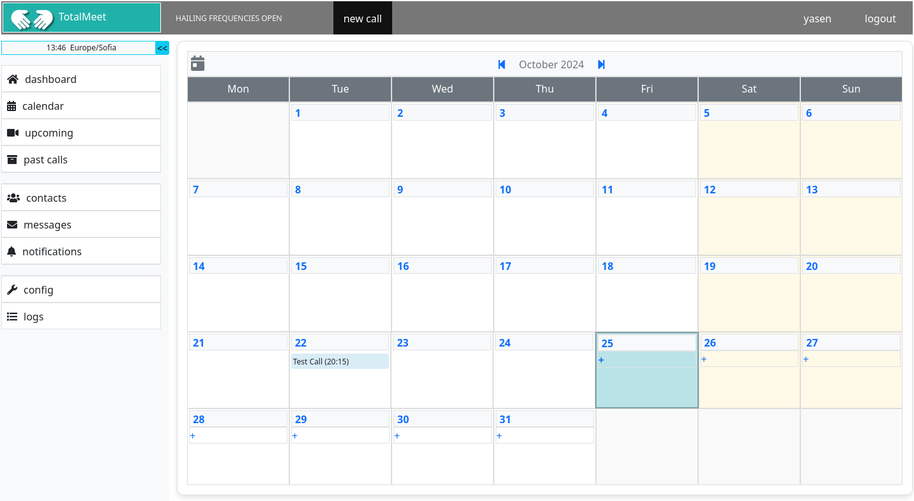

Welcome to the [**Lindeas**](https://lindeas.com/) collection of software projects.

## Jilo

Jilo is a collection of services and tools for managing a Jitsi Meet platform

You can check it live at our [demo server](https://work.lindeas.com/jilo-web-demo/).

### jilo-server

Monitoring server with a web interface. It's where you look at the stats and graphs. It's where you manage most of the Jilo settings.

### jilo-agent

Small server on a remote jitsi machine. Checks the local jitsi processes, gets configuration or usage data and sends it to the Jilo Server.

### jilo-cli

Shell script on a remote jitsi machine. Runs periodically to fetch data from the jitsi logs. Jilo Agent can then send them to the server.

## TotalMeet

[**TotalMeet**](https://totalmeet.com/) is a hosted webconferencing solution, based on Jitsi Meet.

It has a custom user profile and dashboard pages, and is aimed at helping communities and small to medium businesses get most of Jitsi Meet.

You can use our own jitsi backend, or you can connect it to an external one - either your own or the official hosted backend from the Jitsi project, [**JaaS**](https://jaas.8x8.vc/).

TotalMeet is still under construction, but if you are interested, please subscribe on the website to get notified once we launch it.
